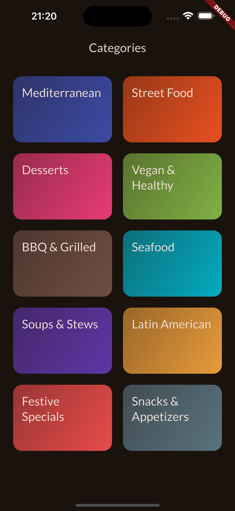
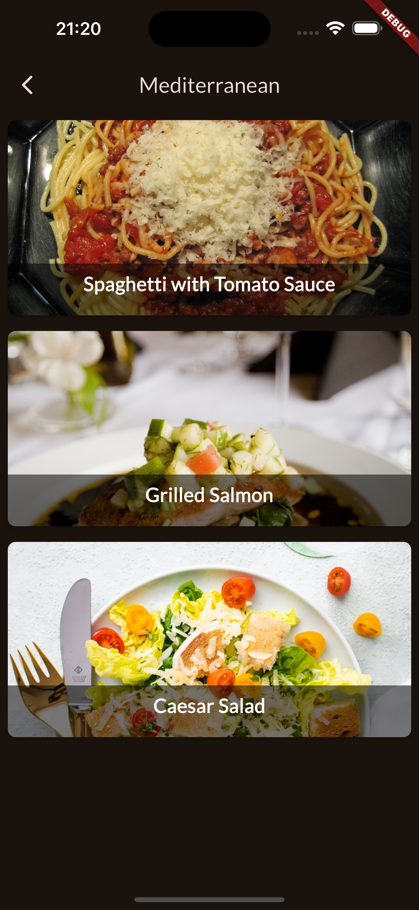

# Flutter Meals App

A comprehensive Flutter application for browsing meal categories, exploring recipes, and managing favorites. Built with Material Design 3, this app demonstrates modern Flutter development patterns, navigation systems, and responsive UI design.

## 📸 Screenshots

<div align="center">
  
  
</div>

*Left: Categories grid with colorful meal categories | Right: Mediterranean meals listing*

## 📱 Features

- **Browse Meal Categories**: View various meal categories in a responsive grid layout
- **Recipe Details**: Read detailed cooking instructions for selected meals
- **Favorites System**: Mark and manage favorite meals for easy access
- **Navigation Tabs**: Switch seamlessly between all meals and favorites
- **Advanced Filtering**: Apply filters for vegan, vegetarian, gluten-free, and lactose-free dietary preferences
- **Side Drawer Navigation**: Access filters and other options through a dedicated navigation drawer
- **Multi-Screen Navigation**: Navigate through multiple interconnected screens

## 🏗️ Architecture

The app follows modern Flutter architecture patterns with Riverpod state management:

- **Entry Point**: `lib/main.dart` - MaterialApp setup with Material Design 3 theming, wrapped in `ProviderScope`
- **State Management**: Riverpod providers for reactive state management
  - `lib/providers/meals_provider.dart` - Simple Provider for meals data
- **Categories Screen**: `lib/screens/categories_screen.dart` - Grid layout for meal categories
- **Meals Screen**: `lib/screens/meals_screen.dart` - Lists meals for selected category
- **Meal Details Screen**: `lib/screens/meals_details_screen.dart` - Individual meal details
- **Tabs Screen**: `lib/screens/tabs_screen.dart` - Main navigation with tabs and drawer integration
- **Filters Screen**: `lib/screens/filters_screen.dart` - Advanced filtering for dietary preferences
- **Favorites Management**: System for marking and viewing favorite meals
- **Side Drawer**: `lib/widgets/main_drawer.dart` - Navigation drawer with app sections

## 🎨 Design & UI

- **Material Design 3**: Modern design system with custom orange color scheme
- **Dark Theme**: Default dark theme for better user experience
- **Typography**: Google Fonts (Lato) for consistent and readable text
- **Responsive Grid**: 2-column grid layout with 3:2 aspect ratio for categories
- **Smooth Navigation**: Intuitive navigation between different app sections

## 🚀 Getting Started

### Prerequisites
- Flutter SDK 3.8.1 or higher
- Dart SDK
- iOS Simulator / Android Emulator or physical device

### Installation

1. Clone the repository:
```bash
git clone [repository-url]
cd meals
```

2. Install dependencies:
```bash
flutter pub get
```

3. Run the app:
```bash
flutter run
```

## 🛠️ Development Commands

- `flutter run` - Run the app in debug mode
- `flutter build apk` - Build Android APK
- `flutter build ios` - Build iOS app
- `flutter test` - Run tests
- `flutter analyze` - Run static analysis
- `flutter pub get` - Get dependencies
- `flutter pub upgrade` - Upgrade dependencies
- `flutter clean` - Clean build artifacts

## 📦 Dependencies

### Production Dependencies
- **flutter_riverpod**: ^3.0.1 - State management with Riverpod
- **google_fonts**: ^6.3.1 - Lato font family integration
- **cupertino_icons**: ^1.0.8 - iOS style icons
- **transparent_image**: ^2.0.1 - Fade-in image loading effects

### Development Dependencies
- **flutter_lints**: ^5.0.0 - Code quality and linting rules
- **test**: ^1.25.15 - Testing framework

## ✨ Key Features Implemented

- **10 Diverse Meal Categories**: Mediterranean, Street Food, Desserts, Vegan & Healthy, BBQ & Grilled, Seafood, Soups & Stews, Latin American, Festive Specials, and Snacks & Appetizers
- **Rich Recipe Database**: Over 20 carefully curated recipes with detailed ingredients and step-by-step instructions
- **Dietary Information**: Each meal includes dietary tags (vegan, vegetarian, gluten-free, lactose-free)
- **Affordability & Complexity Ratings**: Visual indicators for meal cost and cooking difficulty
- **High-Quality Food Photography**: Curated images from Unsplash for appetizing visual presentation

## 📁 Project Structure

```
lib/
├── main.dart                    # App entry point with ProviderScope wrapper
├── providers/                   # Riverpod providers for state management
│   └── meals_provider.dart      # Simple Provider for meals data
├── models/                      # Data models (meals, categories)
│   ├── category.dart            # Category model with id, title, color
│   └── meals.dart               # Meal model with ingredients, steps, dietary info
├── screens/                     # App screens
│   ├── categories_screen.dart   # Categories grid screen
│   ├── meals_screen.dart        # Meals listing screen for selected category
│   ├── meals_details_screen.dart # Individual meal detail screen
│   ├── tabs_screen.dart         # Main navigation with tabs and drawer
│   └── filters_screen.dart      # Dietary filters configuration screen
├── widgets/                     # Reusable UI components
│   ├── category_grid_item.dart  # Category item widget
│   ├── meal_item.dart           # Individual meal item widget with metadata
│   ├── meal_item_trait.dart     # Meal metadata trait widget
│   ├── main_drawer.dart         # Navigation drawer component
│   └── filterswitch_tile.dart   # Filter toggle switch component
├── data/                        # Static data and dummy content
│   └── mock_data.dart           # Categories and meals mock data
└── screenshots/                 # App screenshots for documentation
```

## 🎯 Project Overview

This project serves as a hands-on exploration of:
- **Flutter Framework**: Modern declarative UI development with Material Design 3
- **Navigation Patterns**: Multi-screen navigation with smooth transitions
- **Responsive Design**: Grid layouts and adaptive UI components
- **Custom Theming**: Dark theme implementation with Material Design principles
- **Data Architecture**: Structured models and mock data management
- **Modern Flutter APIs**: Latest widgets and development patterns

## 🏗 Key Technologies

### **Flutter + Material Design 3**
- **UI Framework**: Declarative widgets with Material Design 3 components
- **State Management**: Riverpod for reactive and efficient state management
- **Navigation**: Multi-screen routing with smooth transitions
- **Theming**: Custom dark theme with orange color scheme
- **Typography**: Google Fonts (Lato) integration
- **Responsive Layouts**: Grid systems and adaptive components

## 🔄 Navigation Flow

```
Categories Screen → Selected Category → Meals List → Meal Details → Recipe Instructions
       ↓                     ↓              ↓             ↓
   Back to Categories ← ← ← ← ← ← ← ← ← ← ← ← ← ← ← ← Back Navigation
```

**Current Implementation Status:**
- ✅ Categories grid screen with 10 diverse categories
- ✅ Category-to-meals navigation
- ✅ Meals listing screen for selected categories with rich metadata display
- ✅ Individual meal detail screens (basic implementation with image display)
- ✅ Enhanced meal items with duration, complexity, and affordability indicators
- ✅ Fade-in image loading with transparent image placeholders
- ✅ Side drawer navigation with app sections
- ✅ Advanced filtering system (vegan, vegetarian, gluten-free, lactose-free)
- ✅ Favorites system with tab-based navigation
- 🔄 Detailed recipe instructions and ingredients (in development)

## 🤝 Contributing

Feel free to explore the code, suggest improvements, or use it as a reference for your Flutter development journey.

## 📄 License

This project is created for educational purposes.

---

## 📚 Course Attribution

This project is developed as part of the **Udemy course "Flutter & Dart - The Complete Guide"**. The implementation follows the course curriculum while exploring advanced Flutter concepts and adding personal enhancements to deepen the learning experience.

*This project is designed for educational purposes to explore Flutter development, navigation patterns, and modern mobile app architecture.*
